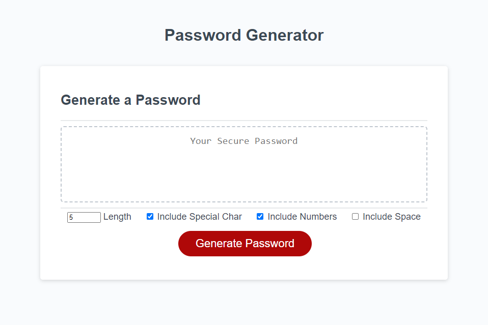

# Javascript-Pass-Gen

## User Story
AS AN employee with access to sensitive data  
I WANT to randomly generate a password that meets certain criteria  
SO THAT I can create a strong password that provides greater security

## Acceptance Criteria
GIVEN I need a new, secure password  
WHEN I click the button to generate a password  
THEN I am presented with a series of prompts for password criteria  
WHEN prompted for password criteria  
THEN I select which criteria to include in the password  
WHEN prompted for the length of the password  
THEN I choose a length of at least 8 characters and no more than 128 characters  
WHEN asked for character types to include in the password  
THEN I confirm whether or not to include lowercase, uppercase, numeric, and/or special characters  
WHEN I answer each prompt  
THEN my input should be validated and at least one character type should be selected  
WHEN all prompts are answered  
THEN a password is generated that matches the selected criteria  
WHEN the password is generated  
THEN the password is either displayed in an alert or written to the page  

## Description
To create a small javascript program to help me randomly select a password for security. Not involing my tendentices should help with people not being able to guess it. I build this program to incorporate javascript into a webpage containing html and Css in a simple example. Its solves my indecisiveness of chooseing password to use with accounts. I learned querySelector in java, with selecting an ID.

## Usage

[Link to Deployed Webpage](https://kevinrhode.github.io/Java-pass-generator/)

[Link to Repo](https://github.com/KevinRhode/Java-pass-generator)

* password length:

  -Set the length of your generated password. range 8-128
* include special char:

   
  -if checked include special characters in the possiable generated password  
  -[Link to Doc of Characters](https://owasp.org/www-community/password-special-characters)
* include numbers
      
    -if checked include numbers in the possiable generated password 

## Credits

https://stackoverflow.com/questions/1497481/javascript-password-generator

https://www.w3schools.com/js/js_popup.asp

